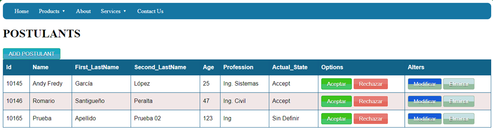
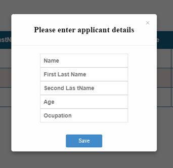
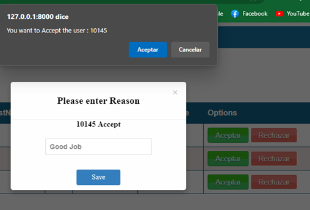
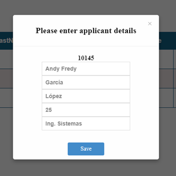

# CRUD Django Python

Using:
* Python
* Django
* Django REST
* SQL Server
* HTML, CSS, JavaScript


## Configuration

### Init

* Create Env ss:
  ``` bash
  python -m venv env
  ``` 

* Activate Env:
  ``` bash
  env\Scripts\activate
  ```

* Options in Env

  * Desactivate:
    ``` bash
    deactivate
    ```

  * List Librarys:
    ``` bash
    pip list
    ```

  * Update pip:
    ``` bash
    py -m pip install --upgrade pip
    ```

### BackEnd

* Init Project
  
  ``` bash
  pip install -r requirements.txt
  ```


* Content requirements.txt

  * Django==4.0.7
  * mssql-django==1.1.3
  * djangorestframework==3.11.0
  * djangorestframework-simplejwt==4.6.0
  * django-model-utils==4.0.0
  * Markdown==3.4.1
  * django-filter==22.1
  * requests==2.28.1

* Create Project
  ``` bash
  django-admin startproject Proyecto
  ```

* Create Module
  ``` bash
  cd Proyecto
  django-admin startapp Postulantes
  django-admin startapp api

  ```

* Run Server with `manage.py`
  ``` bash
  py manage.py runserver
  ```

****
## Views

#### index

****
#### Add Postulant


****
#### Change Status



****
#### Update

